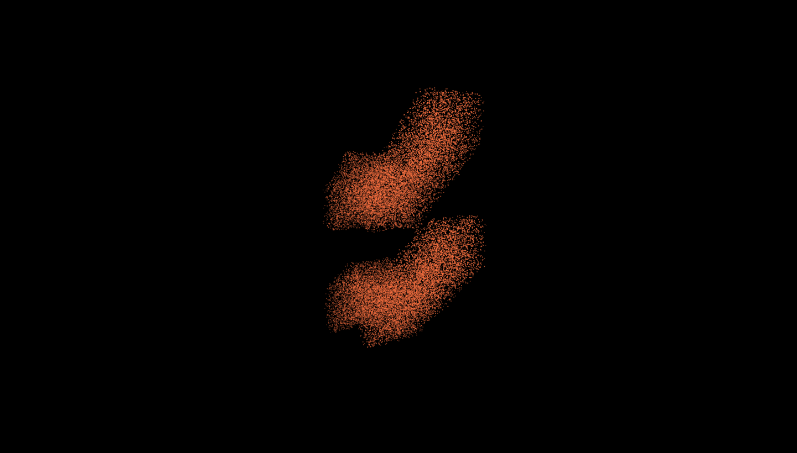
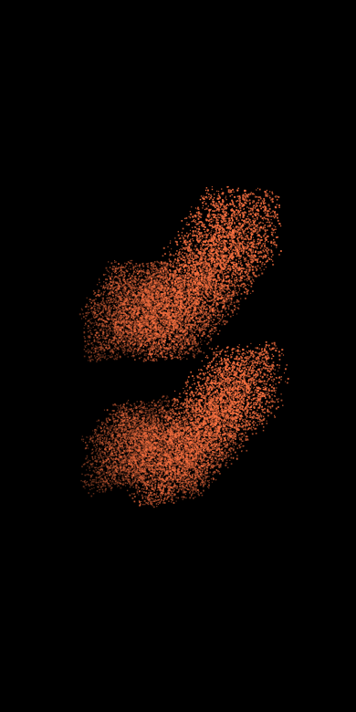

# Uprising — 3D Particle Mark

The Uprising mark as a rotating point cloud: ~25 000 particles extruded into a slab,
spun with a hand-rolled perspective projection and drawn on a plain `<canvas>`.

No libraries, no WebGL, no build step. One HTML file, one stylesheet, one script.





## Run it

Open `index.html` in a browser. That's it.

For GitHub Pages: push the repo, then **Settings → Pages → Deploy from branch → `main` / root**.

## How it works

1. **Vectors → mask.** The logo paths (from `logo.svg`, the orange sign only) are filled once
   into an offscreen canvas, scaled to the viewport.
2. **Mask → volume.** That canvas is read back with `getImageData` and scanned on a grid.
   Every pixel above the alpha threshold becomes a particle, and each particle gets a random
   **Z** inside a slab — so the flat silhouette turns into an extruded solid rather than a
   sheet. Sub-pixel jitter keeps it reading as dust instead of a screen door.
3. **Rotation.** Every frame the cloud is rotated (yaw around Y, then pitch around X) and
   projected through a perspective divide `f = focal / (focal + z)`. The same `f` scales each
   particle, so near dots are bigger — that alone sells the depth.
4. **Depth cue + speed.** Particles are bucketed by Z into 8 opacity levels and drawn back to
   front. One `fillStyle` per bucket means a full frame costs ~8 state changes instead of
   25 000, and the far side of the volume naturally fades out.
5. **Life.** Each particle also drifts on its own 3D sine wobble, so the surface keeps moving
   even when the rotation is slow.

Interaction: the cloud spins by itself, the pointer steers yaw and pitch, a click adds a
spin impulse that damps out.

## Tuning

Everything lives in the `CONFIG` object at the top of `particles.js`:

| key | what it does |
| --- | --- |
| `color`, `background` | palette (RGB triplet / CSS color) |
| `step` | sampling grid in px — **lower = denser = more particles** |
| `maxParticles` | hard cap; the grid relaxes automatically until it fits |
| `margin` | free space left around the cloud (`1` = touch the edges) |
| `maxFill` | upper bound on how wide the mark may get, as a share of the viewport |
| `maxParticles`, `maxParticlesMobile` | draw budget for desktop and for phones |
| `depth` | extrusion thickness, as a fraction of the mark's height |
| `focal` | perspective strength — smaller = wider lens, stronger distortion |
| `sizeMin` / `sizeMax`, `alphaMin` / `alphaMax`, `buckets` | grain and depth falloff |
| `glow` | soft radial bloom behind the shape, `0` to disable |
| `spin` | idle rotation speed, radians per ms |
| `spinImpulse`, `spinDamping` | click kick and how fast it dies |
| `steerYaw`, `steerPitch`, `steerEase` | how far and how smoothly the pointer turns it |
| `swirl`, `swirlSpeed` | how much the particles move inside the shape |
| `introDuration`, `introStagger` | assemble animation |

## Using a different shape

Replace the entries in `MARK.paths` with your own SVG path data and update
`MARK.width` / `height` / `offsetX` / `offsetY` to the path bounding box.
Anything that fills as a closed shape works — a logo, an icon, a letterform.

## Notes

- `prefers-reduced-motion` is respected: rotation and wobble are switched off.
- **Portrait screens.** The cloud is a rotating box, so at some angles it projects wider than
  the mark itself. The scale is therefore solved from the worst-case projected extents —
  half the mark plus half the extrusion, tilted by the maximum pitch and magnified by
  perspective — instead of from the flat silhouette. Nothing gets cropped at any angle on
  any aspect ratio. Height uses `dvh`, so the mobile browser bar sliding in doesn't clip it.
- Phones get a smaller particle budget (`maxParticlesMobile`); the sampling grid relaxes
  automatically until the count fits, so the look is identical and only the grain changes.
- Device pixel ratio is capped at 2; the field re-samples on resize.
- It survives starting inside a hidden or zero-sized container (`ResizeObserver` + retry),
  which is the usual failure mode for canvas sections sitting below the fold.

## Files

```
index.html     markup
style.css      layout
particles.js   the whole effect
logo.svg       source mark (reference; the paths are inlined in particles.js)
```
